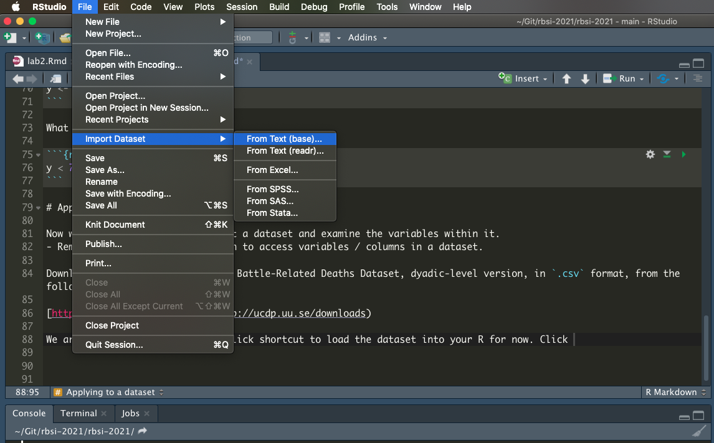

# Technical Questions

## Vectors 

Consider the following vectors: 

```{r}
p <- c(1,2,3,4)
q <- c(7,3,5,2)
r  <- c(1,2)
```

What is the value of `p + q`? 

What is the value of `p + r`?


## Dataframes

If:
```{r}
Age <- c(22, 25, 18, 20)
Name <- c("James", "Mathew", "Olivia", "Stella")
Gender <- c("M", "M", "F", "F")
```

then what is the R-code for getting the following output;

```{r, echo=FALSE}
data.frame(Age, Name, Gender)
```

## Data Types

If: 

```{r}
x <- c("Peony", "Thyme", "Honeysuckle", "Olive")
z <- 0:9
```

then what is the output from the following R-statements:

```{r, results='hide'}
as.character(z)
as.factor(x)
```

## Logical Operators

```{r}
y <- c(21, 4, 7, 2, 10, 5, 12, 6)
```

What is the value of: 

```{r, results = 'hide'}
y < 7
```

# Applying to a dataset

Now we are going to try and import a dataset and examine the variables within it. 
- Remember to use the `$` notation to access variables / columns in a dataset. 

Download and load into R the UCDP Battle-Related Deaths Dataset, dyadic-level version, in `.csv` format, from the following website: 

[http://ucdp.uu.se/downloads](http://ucdp.uu.se/downloads)

We are going to use a point-and-click shortcut to load the dataset into your R for now. 

From the RStudio dropdown menu, select `File > Import Dataset > From text (base)`, (see image below if these instructions are unclear) and then from the pop-up, locate your downloaded csv file. 




The dataset should open automatically and you should see a similar code in your console as below: 

```{r, results = 'hide'}
ucdp.brd.dyadic.201 <- read.csv("~/Downloads/ucdp-brd-dyadic-201.csv")
View(ucdp.brd.dyadic.201)
```

We are going to examine one variable: 

1. **bd_best**
  - Without looking at the codebook, what format is it in? (continuous, integer, character, etc)? 
  - Calculate and provide the mean, variance, and range of bd_best. 
  - How many (if any) missing values are present in bd_best? 
  - Now check the codebook, what does bd_best measure? 


