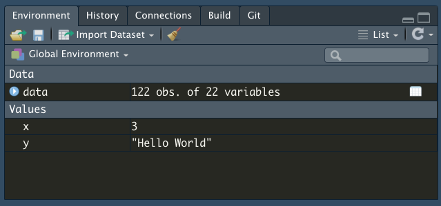

```{r, include = FALSE}
rm(list=ls())
library(DT)
datatable(mtcars, rownames = FALSE, filter="top", options = list(pageLength = 5, scrollX=T) )
```

# R and RStudio

In order to perform most of the data manipulations in this class, we will be teaching it through R, which is a programming language often used in statistics. 

- Other options: Python (huge learning curve), Stata (Not free), SAS/SPSS (Not free) 

Rstudio is a free software program that makes using R much easier. 
- As its name implies, it is a 'studio' or 'editor' (actually an integrated development environment, IDE) to make R easier to work with
- IMPORTANT: Rstudio is not R. Without R downloaded, R studio has nothing to 'work with'
- R studio gives us clickable options and allows us to integrate pre-made software packages for statistical analysis 

- Left: R console; Right: R Studio console. Notice how there are more options in R Studio.

{width=300px} {width=500px}

# Downloading and Installing

## R (PC, Mac, & Linux)

### Downloading R

1. Go to https://cran.r-project.org/
2. On the front page, under ”Download and Install R”, select the appropriate download for your operating system.
3. For Windows users, click ”Download R for Windows,” and then select ”base”, and then ”Download R 3.6.0 for Windows.”
4. For Mac users, click ”Download R for Mac OS X,” and then select ”R-3.6.0.pkg”
5. Once your file is downloaded, run and install the R .exe (windows) or .dmg (for Mac OS) file (this will look a little different depending on your computer)

### Version Control for R

- version # allows us to see current R info on a computer
- E.g. I am currently running R version 3.6.2 (2019-12-12) -- "Dark and Stormy Night"
Copyright (C) 2019 The R Foundation for Statistical Computing
Platform: x86_64-apple-darwin15.6.0 (64-bit)

<center>
{width=400px}
</center>

- Sometimes the version matters because R is a free software with contributions from other programmers, often called "packages" as we will show later. Packages can be consistently updated by authors, but may depreciate if not kept up. So if you run into problems using a package, the first step is often making sure your version of R is up to date with what the package requires. 
- Here I'm running R 3.6.2, from 2019, which means I probably need an update! 


## R Studio

1. Go to https://www.rstudio.com/
2. On the front page, click ”Download RStudio”
3. We want the RStudio Desktop Open Source License, so select ’Download’ for that option
4. Now, you’ll see a list of ”Installers for Supported Platforms”; click the one that’s right for your computer and download it.
5. Run the file to install RStudio and follow the instructions.

### Version Control for RStudio

- When you update R this does not update RStudio, and vice versa
- Unlike the R version, we have to run a line of code to access the R Studio Version, or find it in the "About RStudio" dropdown menu.

```
RStudio.Version() # checks version of RStudio on computer
```

```
$citation

To cite RStudio in publications use:

  RStudio Team (2019). RStudio: Integrated Development for
  R. RStudio, Inc., Boston, MA URL http://www.rstudio.com/.

A BibTeX entry for LaTeX users is

  @Manual{,
    title = {RStudio: Integrated Development Environment for R},
    author = {{RStudio Team}},
    organization = {RStudio, Inc.},
    address = {Boston, MA},
    year = {2019},
    url = {http://www.rstudio.com/},
  }


$mode
[1] "desktop"

$version
[1] ‘1.2.5033’

$release_name
[1] "Orange Blossom"
```

For a much more detailed intro to R, check out: 
https://cran.r-project.org/doc/manuals/R-intro.pdf 

*** 

<center>
# **Welcome to RStudio **
</center> 

***

## User Interface (UI) explanation 


**Panel 1 - Console**

- where code is run/executed
- logs all of your past commands and output
- you can work from just the console, but this is not advised
  - R without RStudio is just the console

**Panel 2 - Script**

- write your code here, and run it from here, so you can keep track of everything
- think of it as your word document but for your code
- The entire script can be run at once (cmd*A + cmd*enter)
- Or line-by-line (cmd*enter) [Mac]
- This is also where you can have your code, data, and files in general stored as tabs

**Panel 3 - Local Environment**

- This shows what variables or objects you have created in this session, and what each of them means
- In the example below, we create three 'objects': x, y, and data; which are then stored in the environment until they are changed or reassigned

```{r}
x <- 3 # variables can be stored in local environment
y <- "Hello World"
data <- read.csv("germancities.csv") # so can datasets
View(data)
```

{width=300px}

{width=300px}

> **Syntax: How to clear the environment**

```{r}
rm(x) # things can be removed individually
rm(list=ls()) # or all at once
```


**Panel 4 - Everything Else**

- includes filepaths, plot viewer, package loader, help window, etc.
- we will come back to most of these topics over time
- You can edit the UI as you wish by going to 'Preferences' under the 'RStudio' tab

***

## Basics of Programming

**Data Types/Elements/Primitives in R**

There are different 'types' of information stored in R as data, some include: (but there are more)

1. Numeric 
2. Boolean / Logical
3. String(s)/Characters
4. Factors
5. Vectors
6. Lists
7. Matrices
8. Dataframe 

This list can seem overwhelming, but I find that one way to think of data is to start with a hypothetical dataset (since we are learning about R as a way to approach data and statistics), and then breakdown the data types by what information we need to store in the dataset. 

### Dataframe

**Dataframe**: A dataframe is a general form of data that has columns and rows, like a list or a table, usually with multiple different types of information. You might see something similar in a class roster, a list of invitees to a birthday party, a list of ingredients in a recipe, these are all a form of data we interact with everyday. 

- Using sample data of a list of employees from microsoft, below is a dataset with five columns, and five rows of data (plus the first row for the names of each column)
- [Data Source](https://support.microsoft.com/en-us/office/vlookup-function-0bbc8083-26fe-4963-8ab8-93a18ad188a1)

```{r}
data <- read.csv("excel-employee.csv")
datatable(data, rownames = FALSE, filter="top", options = list(pageLength = 5, scrollX=T))
```

- There are five types of information in the data above, as captured by each column
  1. The employee's ID (a number)
  2. Last Name (a word, or a series of alphabetical characters)
  3. First Name (a word, or a series of alphabetical characters)
  4. Title (words, belonging to categories of different job titles the employee can have)
  5. Birth Date (a number, with a specific format of MM/DD/YY)

So in the dataset above, we already have at least two to four types of data. 

The dataset itself is a dataframe (type 8), the employees ID can be numerical (type 1), the names can be thought of characters or words (type 3). If there are a few limited categories for the job title, it can be a type of factor (type 4). We will go into these in more detail. 
Note that in this case, the variables are structured as the columns of the data, but that does not always have to be the case, variables can also be in the rows of the data. 

### Matrices

**Matrices (plural) or a Matrix (singular)** are a more specific type of dataframe, where all the columns must have the same data type, and are of the same length. Most commonly, matrices are numerical (think the matrix in the movie The Matrix!)

Below we have a 4x3 matrix, with four rows, three columns. 

```{r}
matrix (1:12, nrow = 4, ncol = 3)
```

### Vectors and Lists

- Whereas matrices have both rows and columns, vectors and lists operate in one dimension. 
- So you can think of matrices as made of vectors 
- The key difference between vectors and lists is that vectors should contain the same kind of information in each element, while lists can mix elements 
- the notation for vectors is `c()`, and the notation for lists is `list()`
- Note that in the example below, though the input is the same for both x and y, since vectors require all elements to be the same, it has interpreted `2` as a letter instead of a number (More on this in the next section)

```{r}
x <- c('mike', 2, 'lucy')
x 
y <- list('mike', 2, 'lucy')
y
```

### Numeric / Strings and Characters / Boolean

The smallest unit of data will be individual elements - this can take the form of numbers, words, characters, or booleans. Lists and vectors are made of one or more elements, and dataframes and matrices are made of one or more lists or vectors or elements. 

1. *Numeric* 
- represents a number, either whole or real 
```{r}
whole.number <- 6
real.number <- 3.141592
```

2. **Characters and Strings** 
- characters are any form of data that has an alphabet in it, multiple characters in a row are strings, whether or not they are words. If there is a mix of characters and numbers, R automatically interprets it as a string. 
- the syntax for characters (and strings) is that they have to be enclosed in quotation marks like `"a"`
- in the example below, char.two yields an error because the `a` is not enclosed in quotations

```{r, error = TRUE}
char.one <- "a"
char.two <- a
string.one <- "Hello"
string.two <- "ab12cd"
```

3. *Boolean / Logical* 
- Is a binary variable that can only have either of two answers: `TRUE` or `FALSE`
- Is actually used very often, either in the `TRUE/FALSE` form, or in a `0/1` form
- Think: it is easier to code binary outcomes in binary because it is less prone to error; lets say the data was for a student's attendance, whether they are `Present/Absent` is as easily represented as `True/False`
```{r}
TRUE
FALSE
T
F
```

***

## Using your console

Now that we've covered some of the essential basics of R syntax, let us move to the basics of actually using your console to manipulate data. 

### Syntax: Assignment vs Equals

As you might have noticed in the above code chunks, in R we use the assignment operator `<-` to assign value to objects. There are other assignment operators (such as `=`), but it can be confusing, so stick to using `<-`. 

Value assignment means to set a value to be stored in an object (also called a variable). While this may seem inefficient, we could do `1 + 2` instead of `x = 1, y = 2, x + y`, it becomes increasingly difficult to manually type out the values of interest when the number of values we are working with gets bigger, like in a dataset. 

```{r}
x = 2 # Please avoid at all costs
x <- 4 # Better assignment operator
```

### Syntax: Equal-to and not-equal-to

One of the main reasons why `=` can be confusing is because there is another operator `==` which is the equal-to operator. So it checks if the value on the left is the same as the value on the right, i.e. is `1 == 2`, mathematically it is not. The opposite of the equal-to operator is the not-equal-to operator `!=`

```{r}
x == 4
x == 5
x !=5
```

This equal-to operator becomes very useful when we want to check if two values are the same. Take for instance those forms that ask you to type in your email twice, it probably uses an equal-to operator to determine if you typed the same email twice. 

```{r}
email <- 'john.smith@duke.edu'
email2 <- 'james.smith@duke.edu'
email == email2
```

### Syntax: And vs or 

```{r}
x == 600 & y == 700 # & == 'and this is also true'
```

```{r}
x == 1000 | y == 7 # | == 'this, or this, or both'
```

### Syntax: Checking / Changing Data Types

```{r}
is.numeric(whole.number)
is.factor(whole.number)
as.character(whole.number)
str(whole.number)
```

### Arithmetic Operators

```{r}
tabl <- "
| Operator | Description |
|----------|-------------|
| +        | addition    |
| -        | subtraction |
| *        | multiplication | 
| /        | division    |
| ^ or **  | exponentiation | 
| x %% y   | 5 %% 2 is 1 |
| x %/% y  | 5 %/% 2 is 2 |
"
cat(tabl)
```


# R follows the order of operations: PEMDAS
Print()

### Concatenation, Seq, Rep
- How do we remember multiple numerical values without adding them? 
- How do we add together non-numerical values?
  - We can use lists or vectors [### Vectors and Lists]
  - the `c()` operator for vectors means concatenate
    - just remember that `c()` can only be used for data of the same type
  - for strings we also have the option of using the `paste()` function 

```{r, error = TRUE}
'a' + 'b' # Doesn't work
string.one <- "Hello"
string.two <- "World"
c(string.one, string.two)
c(1,2,3,4,5)
paste(string.one, string.two, sep = " ") # Default sep input 
paste0(string.one, string.two) # Eliminates spacing
paste(string.one, whole.number) # Typecasts numeric
```

Remember in [### Vectors and Lists] I mentioned that vectors have to be the same type? Look at what happens when we try and concatenate characters and numbers: 

```{r}
x <- c(1, "a", 2, "b") # but the do have to be the same type!!!!!
# notice that 1 and 2 are of type character, this is called 'type casting'
```


**Syntax: Checking/Changing Type**
```{r}
whole.number
is.numeric(whole.number)
is.factor(whole.number)
as.character(whole.number)
str(whole.number)
```

4. Vectors

```{r}
cookies <- c("chocolate chip", "sugar", "snickerdoodle")
numbers <- c(1, 2, 3, 4, 5)

x <- c(1,2,3,4,5) # the c stands for concatenate
x <- seq(from = 1, to = 5, by = 1) # same as above
x <- 1:5 # same as above
x <- rep(1, times = 10)
x <- c("a","b","c","d") # vectors do not have to be numbers
x <- c(1, "a", 2, "b") # but the do have to be the same type!!!!!
# notice that 1 and 2 are of type character, this is called 'type casting'

x <- 1:10
y <- c(x, 10:1) # vectors can be complex as long as you keep them one type

z <- c(string.one, whole.number)

## Factors
factor.example <- as.factor(c(rep("A",3), rep("B",4), rep("C",6)))
levels(factor.example)
```

```
## [1] "A" "B" "C"
```

```r
factor.example[1]
```

```
## [1] A
## Levels: A B C
```

```r
factor.example[0] # note that R starts at 1, whereas most languages start at 0
```

```
## factor(0)
## Levels: A B C
```

```r
factor.two <- as.factor(seq(1:10))
factor.two + whole.number # Careful! Still allows meaningless calculation
```

```
## Warning in Ops.factor(factor.two, whole.number): '+' not meaningful for
## factors
```

```
##  [1] NA NA NA NA NA NA NA NA NA NA
```

```r
as.numeric(factor.two) + whole.number
```

```
##  [1]  7  8  9 10 11 12 13 14 15 16
```

```r
## Matrices
# vectors in 2 dimensions
x <- matrix(1:10, nrow = 2, ncol = 5, byrow = F) # default is by column
x <- matrix(c(1,"a",2,"b"), nrow = 2, ncol = 2, byrow = T) # same rules as vectors
str(x)
```

```
##  chr [1:2, 1:2] "1" "2" "a" "b"
```

```r
## Dataframes
# Matrices that allow columns to be of different type
# this is the structure for nearly all data sets you will work with
my.data <- data.frame(age = c(35, 24, 18, 72), name = c("Oliver", "Meghan",
                      "Cole", "Violet"))

View(my.data)
my.data$age # the '$' lets R know you want to access something inside of my.data
```

```
## [1] 35 24 18 72
```

```r
my.data$name
```

```
## [1] Oliver Meghan Cole   Violet
## Levels: Cole Meghan Oliver Violet
```

```r
is.numeric(my.data$age)
```

```
## [1] TRUE
```

```r
is.numeric(my.data$name)
```

```
## [1] FALSE
```

```r
# but always beware of factors!
is.character(my.data$name)
```

```
## [1] FALSE
```

```r
is.factor(my.data$name)
```

```
## [1] TRUE
```

```r
my.data$name <- as.character(my.data$name)

## Lists
# loosely defined as a dataframe in n dimensions
# used for hierarchical data structures
x <- list()
x[[1]] <- 1:10 # lists are ordered and a 'page' is accessed using [[i]]
x[[2]] <- c("a","b","c","d")
x[[3]] <- matrix(1:10, nrow = 2, ncol = 5, byrow = T)
x[[4]] <- my.data

y <- list()
y[[1]] <- rep(100,5)
y[[2]] <- 7
x[[5]] <- y # lists can even store other lists

#### Operations ####
# R follows the order of operations: PEMDAS

## Arithmetic
print(5)
```

```
## [1] 5
```

```r
print(2 + 2 - 1)
```

```
## [1] 3
```

```r
print(2 - 3 * 1)
```

```
## [1] -1
```

```r
print(2^2 + 3 * 2 - (1 + 3))
```

```
## [1] 6
```

```r
# when in doubt use parentheses!

# Basic Statistics Functions
x <- rnorm(100, 5, 1) # x is a vector of 100 numbers, dont worry about rnorm

length(x)
```

```
## [1] 100
```

```r
which(x > 6) # output are the locations, NOT VALUES, for which this is true
```

```
##  [1]  14  25  34  42  47  50  60  62  67  72  73  78  80  84  85  87  88
## [18]  93  94  98 100
```

```r
length(which(x > 6)) # how many fit this criteria
```

```
## [1] 21
```

```r
max(x)
```

```
## [1] 7.409226
```

```r
mean(x)
```

```
## [1] 5.136716
```

```r
sd(x)
```

```
## [1] 1.062346
```

```r
summary(x) # gives a variety of statistics about a variable
```

```
##    Min. 1st Qu.  Median    Mean 3rd Qu.    Max. 
##   2.850   4.397   5.272   5.137   5.798   7.409
```

```r
#### Headers, Formatting, Spacing, Commenting, Conventions ####
#### Section ####
### Main
## Major
# Minor
```
