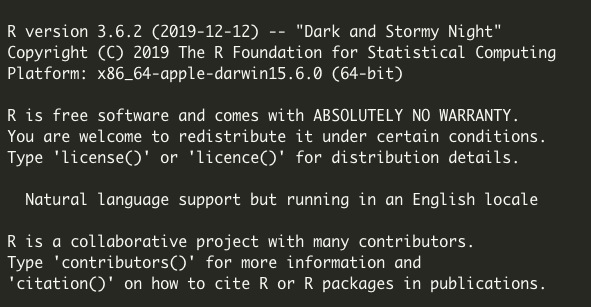
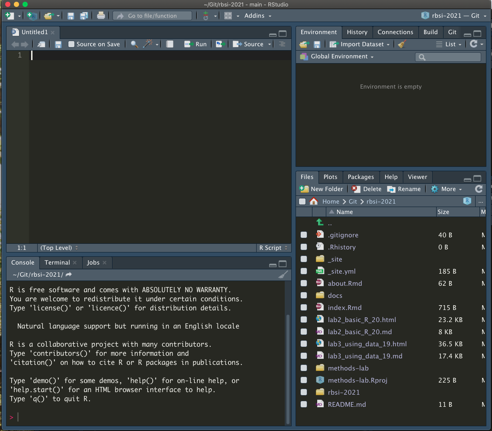
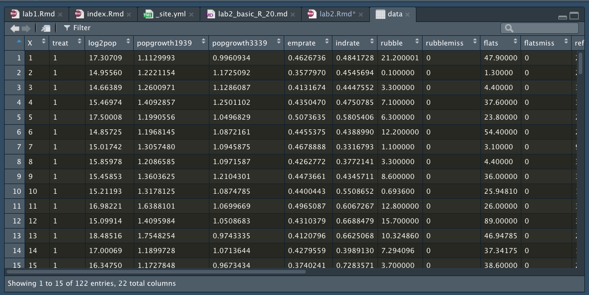

```{r, include = FALSE}
rm(list=ls())
library(DT)
datatable(mtcars, rownames = FALSE, filter="top", options = list(pageLength = 5, scrollX=T) )
```

# PART 1: Downloading & Installing R and R Studio 

In order to perform most of the data manipulations in this class, we will be teaching it through R, which is a free statistical software available for various OS. 

 **R (PC, Mac, & Linux):** http://archive.linux.duke.edu/cran/

- You can download R at the above link
- version # allows us to see current R info on a computer
- E.g. I am currently running R version 3.6.2 (2019-12-12) -- "Dark and Stormy Night"
Copyright (C) 2019 The R Foundation for Statistical Computing
Platform: x86_64-apple-darwin15.6.0 (64-bit)

{width=400px}

- Sometimes the version matters because R is a free software with contributions from other programmers, often called "packages" as we will show later. Packages can be consistently updated by authors, but may depreciate if not kept up. So if you run into problems using a package, the first step is often making sure your version of R is up to date with what the package requires. 
- Here I'm running R 3.6.2, from 2019, which means I probably need an update! 


**R Studio:** https://www.rstudio.com/products/rstudio/download/#download

- IMPORTANT - R Studio is not R, it is an integrated development environment (IDE, also known as an editor) to make R easier to work with
- R studio gives us clickable options and allows us to integrate pre-made software packages for statistical analysis 
- When you update R this does not update RStudio, and vice versa
- We will use R Studio
- Left: R console; Right: R Studio console. Notice how there are more options in R Studio.

{width=300px} {width=500px}

- Unlike the R version, we have to run a line of code to access the R Studio Version, or find it in the "About RStudio" dropdown menu.
```
RStudio.Version() # checks version of RStudio on computer
```

```
$citation

To cite RStudio in publications use:

  RStudio Team (2019). RStudio: Integrated Development for
  R. RStudio, Inc., Boston, MA URL http://www.rstudio.com/.

A BibTeX entry for LaTeX users is

  @Manual{,
    title = {RStudio: Integrated Development Environment for R},
    author = {{RStudio Team}},
    organization = {RStudio, Inc.},
    address = {Boston, MA},
    year = {2019},
    url = {http://www.rstudio.com/},
  }


$mode
[1] "desktop"

$version
[1] ‘1.2.5033’

$release_name
[1] "Orange Blossom"
```

For a much more detailed intro to R, check out: 
https://cran.r-project.org/doc/manuals/R-intro.pdf 

*** 

## Welcome to RStudio - User Interface (UI) explanation 


**Panel 1 - Console**

- where code is run/executed
- logs all of your past commands and output
- you can work from just the console, but this is not advised
  - R without RStudio is just the console

**Panel 2 - Script**

- Keeps track of everything you're doing, so you can forget!
- The entire script can be run at once (cmd*A + cmd*enter)
- Or line-by-line (cmd*enter) [Mac]

**Panel 3 - Local Environment**
```{r}
x <- 3 # variables can be stored in local environment
y <- "Hello World"
data <- read.csv("germancities.csv") # so can datasets
View(data)
```

()

```{r}
rm(x) # things can be removed individually
rm(list=ls()) # or all at once
```


**Panel 4 - Everything Else**

- includes filepaths, plot viewer, package loader, help window, etc.
- we will come back to most of these topics over time
- You can edit the UI as you wish by going to 'Preferences' under the 'RStudio' tab

# PART 2 : Basics of Programming

**Data Types/Elements/Primitives in R**

There are different 'types' of information stored in R as data: 

1. Numeric 
2. Boolean / Logical
3. String(s)/Characters
4. Vectors

1. *Numeric*
```{r}
whole.number <- 6
real.number <- 3.141592

whole.number + real.number
```


2. *Boolean  / Logical*
```{r}
TRUE
FALSE
T
F
```


```{r}
fourty.two <- T
fourty.two
```


```{r}
!fourty.two # ! == 'not'
```

```{r}
x <- 6
y <- 7

x == 6
```

```{r}
x == 600 & y == 700 # & == 'and this is also true'
```

```{r}
x == 1000 | y == 7 # | == 'this, or this, or both'
```

3. *Aside: Assignment vs Equals*
```{r}
x = 2 # Please avoid at all costs
x <- 4 # Better assignment operator
x == 4 # is this true?
```


```r
## String(s)/Characters & Concatenation
string.one <- "Hello"
string.two <- "World"
combo.string <- paste(string.one, string.two, sep = " ") # Default sep input 
combo.string.two <- paste0(string.one, string.two) # Eliminates spacing
combo.string.three <- paste(string.one, whole.number) # Typecasts numeric

## Aside: Checking/Changing Type
is.numeric(whole.number)
```

```
## [1] TRUE
```

```r
is.factor(whole.number)
```

```
## [1] FALSE
```

```r
as.character(whole.number)
```

```
## [1] "6"
```

```r
as.character(whole.number)
```

```
## [1] "6"
```

```r
## Vectors

cookies <- c("chocolate chip", "sugar", "snickerdoodle")
numbers <- c(1, 2, 3, 4, 5)

x <- c(1,2,3,4,5) # the c stands for concatenate
x <- seq(from = 1, to = 5, by = 1) # same as above
x <- 1:5 # same as above
x <- rep(1, times = 10)
x <- c("a","b","c","d") # vectors do not have to be numbers
x <- c(1, "a", 2, "b") # but the do have to be the same type!!!!!
# notice that 1 and 2 are of type character, this is called 'type casting'

x <- 1:10
y <- c(x, 10:1) # vectors can be complex as long as you keep them one type

z <- c(string.one, whole.number)

## Factors
factor.example <- as.factor(c(rep("A",3), rep("B",4), rep("C",6)))
levels(factor.example)
```

```
## [1] "A" "B" "C"
```

```r
factor.example[1]
```

```
## [1] A
## Levels: A B C
```

```r
factor.example[0] # note that R starts at 1, whereas most languages start at 0
```

```
## factor(0)
## Levels: A B C
```

```r
factor.two <- as.factor(seq(1:10))
factor.two + whole.number # Careful! Still allows meaningless calculation
```

```
## Warning in Ops.factor(factor.two, whole.number): '+' not meaningful for
## factors
```

```
##  [1] NA NA NA NA NA NA NA NA NA NA
```

```r
as.numeric(factor.two) + whole.number
```

```
##  [1]  7  8  9 10 11 12 13 14 15 16
```

```r
## Matrices
# vectors in 2 dimensions
x <- matrix(1:10, nrow = 2, ncol = 5, byrow = F) # default is by column
x <- matrix(c(1,"a",2,"b"), nrow = 2, ncol = 2, byrow = T) # same rules as vectors
str(x)
```

```
##  chr [1:2, 1:2] "1" "2" "a" "b"
```

```r
## Dataframes
# Matrices that allow columns to be of different type
# this is the structure for nearly all data sets you will work with
my.data <- data.frame(age = c(35, 24, 18, 72), name = c("Oliver", "Meghan",
                      "Cole", "Violet"))

View(my.data)
my.data$age # the '$' lets R know you want to access something inside of my.data
```

```
## [1] 35 24 18 72
```

```r
my.data$name
```

```
## [1] Oliver Meghan Cole   Violet
## Levels: Cole Meghan Oliver Violet
```

```r
is.numeric(my.data$age)
```

```
## [1] TRUE
```

```r
is.numeric(my.data$name)
```

```
## [1] FALSE
```

```r
# but always beware of factors!
is.character(my.data$name)
```

```
## [1] FALSE
```

```r
is.factor(my.data$name)
```

```
## [1] TRUE
```

```r
my.data$name <- as.character(my.data$name)

## Lists
# loosely defined as a dataframe in n dimensions
# used for hierarchical data structures
x <- list()
x[[1]] <- 1:10 # lists are ordered and a 'page' is accessed using [[i]]
x[[2]] <- c("a","b","c","d")
x[[3]] <- matrix(1:10, nrow = 2, ncol = 5, byrow = T)
x[[4]] <- my.data

y <- list()
y[[1]] <- rep(100,5)
y[[2]] <- 7
x[[5]] <- y # lists can even store other lists

#### Operations ####
# R follows the order of operations: PEMDAS

## Arithmetic
print(5)
```

```
## [1] 5
```

```r
print(2 + 2 - 1)
```

```
## [1] 3
```

```r
print(2 - 3 * 1)
```

```
## [1] -1
```

```r
print(2^2 + 3 * 2 - (1 + 3))
```

```
## [1] 6
```

```r
# when in doubt use parentheses!

## Basic Statistics Functions
x <- rnorm(100, 5, 1) # x is a vector of 100 numbers, dont worry about rnorm

length(x)
```

```
## [1] 100
```

```r
which(x > 6) # output are the locations, NOT VALUES, for which this is true
```

```
##  [1]  14  25  34  42  47  50  60  62  67  72  73  78  80  84  85  87  88
## [18]  93  94  98 100
```

```r
length(which(x > 6)) # how many fit this criteria
```

```
## [1] 21
```

```r
max(x)
```

```
## [1] 7.409226
```

```r
mean(x)
```

```
## [1] 5.136716
```

```r
sd(x)
```

```
## [1] 1.062346
```

```r
summary(x) # gives a variety of statistics about a variable
```

```
##    Min. 1st Qu.  Median    Mean 3rd Qu.    Max. 
##   2.850   4.397   5.272   5.137   5.798   7.409
```

```r
#### Headers, Formatting, Spacing, Commenting, Conventions ####
#### Section ####
### Main
## Major
# Minor
```

```{r setup, include=FALSE}
knitr::opts_chunk$set(echo = TRUE)
```

## R Markdown

This is an R Markdown document. Markdown is a simple formatting syntax for authoring HTML, PDF, and MS Word documents. For more details on using R Markdown see <http://rmarkdown.rstudio.com>.

When you click the **Knit** button a document will be generated that includes both content as well as the output of any embedded R code chunks within the document. You can embed an R code chunk like this:

```{r cars}
summary(cars)
```

## Including Plots

You can also embed plots, for example:

```{r pressure, echo=FALSE}
plot(pressure)
```

Note that the `echo = FALSE` parameter was added to the code chunk to prevent printing of the R code that generated the plot.
