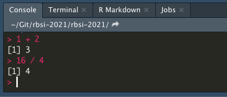
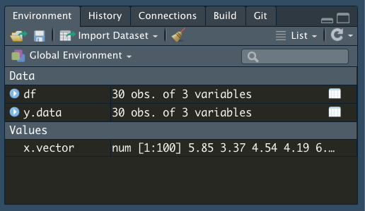

```{r, include = FALSE}
rm(list=ls())
library(DT)
datatable(mtcars, rownames = FALSE, filter="top", options = list(pageLength = 5, scrollX=T) )
```

# R and RStudio

In order to perform most of the data manipulations in this class, we will be teaching it through R, which is a programming language often used in statistics. 

- Other options: Python (huge learning curve), Stata (Not free), SAS/SPSS (Not free) 

Rstudio is a free software program that makes using R much easier. 
- As its name implies, it is a 'studio' or 'editor' (actually an integrated development environment, IDE) to make R easier to work with
- IMPORTANT: Rstudio is not R. Without R downloaded, R studio has nothing to 'work with'
- R studio gives us clickable options and allows us to integrate pre-made software packages for statistical analysis 

- Left: R console; Right: R Studio console. Notice how there are more options in R Studio.

{width=300px} {width=500px}

# Downloading and Installing

## R (PC, Mac, & Linux)

### Downloading R

1. Go to https://cran.r-project.org/
2. On the front page, under ”Download and Install R”, select the appropriate download for your operating system.
3. For Windows users, click ”Download R for Windows,” and then select ”base”, and then ”Download R 3.6.0 for Windows.”
4. For Mac users, click ”Download R for Mac OS X,” and then select ”R-3.6.0.pkg”
5. Once your file is downloaded, run and install the R .exe (windows) or .dmg (for Mac OS) file (this will look a little different depending on your computer)

### Version Control for R

- version # allows us to see current R info on a computer
- E.g. I am currently running R version 3.6.2 (2019-12-12) -- "Dark and Stormy Night"
Copyright (C) 2019 The R Foundation for Statistical Computing
Platform: x86_64-apple-darwin15.6.0 (64-bit)

<center>
{width=400px}
</center>

- Sometimes the version matters because R is a free software with contributions from other programmers, often called "packages" as we will show later. Packages can be consistently updated by authors, but may depreciate if not kept up. So if you run into problems using a package, the first step is often making sure your version of R is up to date with what the package requires. 
- Here I'm running R 3.6.2, from 2019, which means I probably need an update! 


## R Studio

1. Go to https://www.rstudio.com/
2. On the front page, click ”Download RStudio”
3. We want the RStudio Desktop Open Source License, so select ’Download’ for that option
4. Now, you’ll see a list of ”Installers for Supported Platforms”; click the one that’s right for your computer and download it.
5. Run the file to install RStudio and follow the instructions.

### Version Control for RStudio

- When you update R this does not update RStudio, and vice versa
- Unlike the R version, we have to run a line of code to access the R Studio Version, or find it in the "About RStudio" dropdown menu.

```
RStudio.Version() # checks version of RStudio on computer
```

```
$citation

To cite RStudio in publications use:

  RStudio Team (2019). RStudio: Integrated Development for
  R. RStudio, Inc., Boston, MA URL http://www.rstudio.com/.

A BibTeX entry for LaTeX users is

  @Manual{,
    title = {RStudio: Integrated Development Environment for R},
    author = {{RStudio Team}},
    organization = {RStudio, Inc.},
    address = {Boston, MA},
    year = {2019},
    url = {http://www.rstudio.com/},
  }


$mode
[1] "desktop"

$version
[1] ‘1.2.5033’

$release_name
[1] "Orange Blossom"
```

For a much more detailed intro to R, check out: 
https://cran.r-project.org/doc/manuals/R-intro.pdf 

*** 

<center>
# **Welcome to RStudio **
</center> 

The rest of this lab will center on running through the basics of using R, using the RStudio interface, and getting familiar with the practice of programming and statistical analysis. It will be a lot of content to cover but working with the material hands on will help too! At the end of this tutorial, there will be an R file with the code used today, as well as an activity we will work through in lab to play around with some data and get familiar with the output in R. 

The basis of programming is that we write down instructions for the computer to follow, and then we tell the computer to follow those instructions. We write, or code, instructions in R because it is a common language that both the computer and we can understand. We call the instructions commands and we tell the computer to follow the instructions by executing (also called running) those commands.

***

## Programming basics and key points 

To begin, open up RStudio, and you will usually see the main window has been divided into four panels. We will primarily be using the two panels on the left, the top is the script, and the bottom is the console. 


There are two main ways of interacting with R, by writing code and running it from the script (Panel 1), or by typing it and executing it in the console (Panel 2). 

1. The script is where you will write your code, or documentation, think of it as a document where your instructions go. But unless you run these instructions, they are just text to the computer. You can run your script selecting the command you desire, and using the `Ctrl` + `Enter` shortcut on Windows, or `Cmd` + `return` on Macs. 

2. On the console, you can type your command in and directly run it by pressing `Enter`.

### Calculations, Data Elements, and Variable Assignment

- Here is an example of a type of output you get in R console:
- You can use R like a calculator and put in simple math problems like so:

```{r}
1 + 2 
16 / 4
```

This is what that execution and output looks like in RStudio as well. 

{width=200px}

However, to do more, we need to assign **values** to **objects**. To do so, we name an object, let's say we call it *some_numbers*, followed by the assignment operator `<-`, and the value we want to give it: 

```{r}
some_numbers <- 5
```

So now, we can do a series of mathematical operations to some_numbers.

```{r}
2.2 * some_numbers
```

We can also change the value of an object by reassigning it a new value using the same assignment operator `<-`

```{r}
some_numbers <- 10 + 20
some_numbers
```

We could easily multiply 2.2 by 5 ourselves, or add 10 to 20 by hand, but the true power in assigning value to objects is when we have multiple values stored. Below I have a list of five numbers (more on creating lists later), when we save them as one object, we can apply the same mathematical operator on all five of them at the same time without doing more work. 

```{r}
some_numbers <- c(2,3,6,18,108)
some_numbers * 5
```

Isn't that easier than doing it individually to each number?

> Syntax: Case-sensitivity

Note, that R is case-sensitive. Hence, be careful of how you name objects!

```{r, error = TRUE}
some_numbers 
Some_numbers
```

> Syntax: Writing and commenting in-line
> You can also add in-line comments and sections when writing code, so as to introduce some kind of structure or explanation in your code. This makes it easier for both yourself to keep track of the progress you have made, and for a reader to follow your code and what the variables mean. 
> Often we use `#` in-line to indicate a comment, when R sees a `#`, it stops  executing the rest of the line. 
> Some conventions used in sectioning code is to use multiple `####` to indicate headers and major sections in the code, `###` as sub-sections, and just one `#` for minor comments 
> For example, if one had two variables, x and x2, which referred to different things, it could be helpful to comment next to both variables during the assignment process what they mean to you. 

```{r}
x <- 5 # Maximum score for first homework
x2 <- 10 # Total score for first and second homework 
```


### User Interface (UI) explanation


**Panel 1 - Script**

- write your code here, and run it from here, so you can keep track of everything
- think of it as your word document but for your code
- The entire script can be run at once (cmd*A + cmd*enter)
- Or line-by-line (cmd*enter) [Mac]
- This is also where you can have your code, data, and files in general stored as tabs

**Panel 2 - Console**

- where code is run/executed
- logs all of your past commands and output
- you can work from just the console, but this is not advised
  - R without RStudio is just the console

**Panel 3 - Local Environment**

- This shows what variables or objects you have created in this session, and what each of them means
- In the example below, we create three 'objects': x, y, and data; which are then stored in the environment until they are changed or reassigned

```{r}
x <- 3 # variables can be stored in local environment
y <- "Hello World"
data <- read.csv("germancities.csv") # so can datasets
View(data)
```

{width=300px}

{width=300px}

> **Syntax: How to clear the environment**

```{r}
rm(x) # things can be removed individually
rm(list=ls()) # or all at once
```


**Panel 4 - Everything Else**

- includes filepaths, plot viewer, package loader, help window, etc.
- we will come back to most of these topics over time
- You can edit the UI as you wish by going to 'Preferences' under the 'RStudio' tab

***

# Basics of Programming

**Data Types/Elements/Primitives in R**

There are different 'types' of information stored in R as data, these are some of the most common ones that we will encounter:

1. Numeric 
2. Boolean / Logical
3. String(s)/Characters
4. Factors
5. Vectors
6. Lists
7. Matrices
8. Dataframe 

## Basic Data Types

The most basic unit of data types in R are numbers, characters, words, and booleans. 

1. *Numeric* 
- represents a number, either whole or real 
```{r}
whole.number <- 6
real.number <- 3.141592
```

2. **Characters and Strings** 
- characters are any form of data that has an alphabet in it
- Strings are multiple characters in a row, whether or not they are real words that can be found in a dictionary. If there is a mix of characters and numbers, R automatically interprets it as a string. 
- the syntax for characters (and strings) is that they have to be enclosed in quotation marks like `"a"`
- if you reference a word without quotation marks, R will assume and look for objects that have been created called `a`
- in the example below, `char.two` yields an error because the `a` is not enclosed in quotations, and there is no object called `a`

```{r, error = TRUE}
char.one <- "a"
char.two <- a
string.one <- "Hello"
string.two <- "ab12cd"
```

3. *Boolean / Logical* 

- Is a binary variable that can only have either of two answers: `TRUE` or `FALSE`
- Is actually used very often, either in the `TRUE/FALSE` form, or in a `0/1` form
- Think: it is easier to code binary outcomes in binary because it is less prone to error; lets say the data was for a student's attendance, whether they are `Present/Absent` is as easily represented as `True/False`
```{r}
TRUE
FALSE
T
F
```

**4. Factor**

- R has a special class of data that is used fairly commonly, called `factor` data. Factors are used to capture categorical data, where there is a pre-defined set of values. For example take the number of classes in a college - there are four categories used to organize students: freshman, sophomore, junior, and senior. These are used regardless of how many years of study a student might have completed, and are often evaluated based on the quality and quantity of classes and course credits a student has completed. Another often used example for factors is gender: male, female, and other. 

We use the operator `levels()` to find out what the levels in a factor are. Notice that even when the levels are mixed with integers, `as.factor()` interprets them as `character` objects.

```{r}
factor.example <- as.factor(c(rep("Freshman",3), rep("Sophomore",4), rep("Junior",6), rep("Senior", 2)))
levels(factor.example)
factor.example[1]
factor.example2 <- as.factor(c(rep(1,3), rep(2,4), rep("Junior",6), rep("Senior", 2)))
factor.example2
levels(factor.example2)
factor.example2[1]
```

> **Syntax: Checking Data Types**

Knowing the different data types is important because some operations only work with specific data types. For example, though you can add multiple numeric objects together using the addition operator `+`, it is not possible to do the same with character objects, or between character and numeric objects.

```{r, error = TRUE}
5 + 5
"five" + "five"
5 + "five"
```

Aside from getting an error message, there are a couple of tools available to you for determining and changing the data type of an object. 

```{r}
is.numeric(whole.number)
is.numeric(string.one)
str(whole.number)
class(string.one)
```

**Changing data types: **

One example of a need to change data types is when combining data across types. For example, while factors look (and often behave) like character vectors, they can be they are actually treated as integer vectors by R. So you need to be very careful when treating them as strings. Yet because the levels don't have any inherent numerical value, they cannot be combined with numerical objects. They have to be transformed into numeric types first.

```{r}
factor.example + whole.number
as.numeric(factor.example) + 6
```

You can also change numeric types to characters. Remember how strings have the quotation marks `""` around them?
```{r}
as.character(whole.number) 
```


### Example 1

Let's combine some of these basic data types into a type of data some of you might be familiar with - a hypothetical list of student grades. 

```{r}
data <- read.csv("class-grades.csv")
datatable(data, rownames = FALSE, filter="top", options = list(pageLength = 5, scrollX=T))
class(data$Student.ID)
class(data$First.Name)
class(data$Class)
class(data$Grades)
```

Here we have at first glance, two types of data: *numeric* and *character*. 

However, thinking back to the basic data types we just covered, we might find it useful to structure Class as `factor` instead of `character` if we want to organize the data by the seniority of students. Luckily, R has automatically done that conversion for us. But if we needed to do it, remember we can use the operator `as.factor()`.

***

## Vectors and Lists

Vectors and lists are a way to store multiple values or objects, which can be either numbers or characters. 

- the notation for vectors is `c()`
- You can use `c()` to add more elements to an existing vector

```{r}
weights <- c(10, 15, 20, 60, 65)
weights
animals <- c("mouse", "cat", "dog")
animals
c(weights, animals)
```

Lists are similar to vectors in that they are a series of values, however the key difference between vectors and lists is that while vectors should contain the same kind of data types across all objects, lists can mix elements 

- the notation for lists is `list()`
- Note that in the example below, though the input is the same for both x and y, since vectors require all elements to be the same, it has interpreted `2` as a character instead of a number. This is called *type-casting*.
- Hence when we apply the function `class()` to both x and y, class tells us what kind of data is in the vectors, but sees the list as a different data type

```{r}
x <- c('mike', 2, 'lucy')
x 
class(x)
y <- list('mike', 2, 'lucy')
y
class(y)
```

### Using Vectors and Lists

Since vectors and lists are essentially just a group of objects, we can inspect their contents, structure, and also interact with the objects within them as a group. 
- Note the difference between adding a number to every value in a vector, and adding another number to a vector

```{r}
length(weights)
class(weights)
weights + 30
weights2 <- c(weights, 30)
weights2
```

In this case, `weights` is a vector of 5 values, we can extract and replace values at specific locations in the vector. Using square brackets `[]` to select the position of the value we are interested in. 

```{r}
weights[1]
weights[3] <- 5
weights
```

> Syntax: Indices in R
> For those who have some programming experience, R indices start at 1. Other programming languages in the C family such as C++, Java, and Python, start from 0 instead. 

## Matrices

Similar to vectors, **Matrices (plural) or a Matrix (singular)** are a collection of elements arranged into a fixed number of rows and columns. The function `matrix()` creates a matrix. All the columns must have the same data type, and must be the same length, though most often, matrices are numerical (think the matrix in the movie The Matrix!)

Below we have a 4x3 matrix, with four rows, three columns. Here we used `1:12` to create a sequence of numbers from 1 to 12. It is the same as using `c(1,2,3,4,5,6,7,8,9,10,11,12)`

```{r}
1:12
matrix (1:12, nrow = 4, ncol = 3)
```

You can also create a matrix from a vector. Matrices have to have the same column length, so note how `weights` with 5 values is not the right dimension for a matrix (R automatically repeats the first number), but `weights2` with 6 values is. 

```{r}
matrix(weights, byrow = TRUE, nrow = 3)
matrix(weights2, byrow = TRUE, nrow = 3)
```


## Dataframe

**Dataframe**: A dataframe is a general form of data that has columns and rows, like a list or a table. Unlike a matrix, a dataframe usually has multiple different types of information. You might see something similar in a class roster, a list of invitees to a birthday party, a list of ingredients in a recipe, these are all a form of data we interact with everyday. 

If you have a matrix or a list you would like to convert in a dataframe, the associated function is `data.frame()`. However, more often than not we start by importing a dataset into R that we want to work with. 

To access something inside of R, `$` is often used to refer to a column. Below we have a makeshift dataframe with two columns, *age* and *name*. `my.data$age` allows us to reference the age column. 

```{r}
my.data <- data.frame(age = c(35, 24, 18, 72), name = c("Oliver", "Meghan",
                      "Cole", "Violet"))

View(my.data)
my.data$age # the '$' lets R know you want to access something inside of my.data
```


### Example 2

- Using sample data of a list of employees from microsoft, below is a dataset with five columns, and five rows of data (plus the first row for the names of each column)
- [Data Source](https://support.microsoft.com/en-us/office/vlookup-function-0bbc8083-26fe-4963-8ab8-93a18ad188a1)

```{r}
data <- read.csv("excel-employee.csv")
datatable(data, rownames = FALSE, filter="top", options = list(pageLength = 5, scrollX=T))
```

- There are five types of information in the data above, as captured by each column
  1. The employee's ID (a number)
  2. Last Name (a word, or a series of alphabetical characters)
  3. First Name (a word, or a series of alphabetical characters)
  4. Title (words, belonging to categories of different job titles the employee can have)
  5. Birth Date (a number, with a specific format of MM/DD/YY)

So in the dataset above, we already have at least three types of data, from the basic data types we covered earlier.

The dataset itself is a *dataframe*, the employees ID can be *numerical*, the names can be thought of *characters* or string. If there are a few limited categories for the job title, it can be a type of *factor.* 

Note that in this case, the variables are structured as the columns of the data, but that does not always have to be the case, variables can also be in the rows of the data. 

# Using your console

Now that we've covered some of the essential basics of R syntax, let us move to the basics of actually using your console to manipulate data. 

## Arithmetic Operators

One of the most common functions of R is the use of arithmetic operators, here is a complete list of the most common operators. 
- The order of operations is the same as the convention in math: parenthesis, exponents, multiplication and division (from left to right), addition and subtraction (from left to right); also known as PEMDAS.
- when in doubt use parentheses!

| Operator | Description    |
|----------|----------------|
| +        | addition       |
| -        | subtraction    |
| *        | multiplication | 
| /        | division       |
| ^ or **  | exponentiation | 
| x %% y   | 5 %% 2 is 1    |
| x %/% y  | 5 %/% 2 is 2   |

## Logical Operators

Another common operator type are logical operators

| Operator | Description              |
|----------|--------------------------|
| <        | Less than                |
| >        | Great than               |
| <=       | Less than or equal to    |
| >=       | Greater than or equal to |
| ==       | Equal to each other      |
| !=       | Not equal to each other  |

## Help

For any of the functions used here, such as `c()`, `list()`, `data.frame()`, `matrix()`, and any future functions, you can use the `?help` function in R to learn more about a function. 

As shown below, this help function gives you more detail on the function, as well as some of the many options one can specify - such as for matrix, what are the dimensions of the matrix?

```{r}
?matrix
?list
```


## Syntax: Assignment vs Equals

As you might have noticed in the above code chunks, in R we use the assignment operator `<-` to assign value to objects. There are other assignment operators (such as `=`), but it can be confusing, so stick to using `<-`. 

Value assignment means to set a value to be stored in an object (also called a variable). While this may seem inefficient, we could do `1 + 2` instead of `x = 1, y = 2, x + y`, it becomes increasingly difficult to manually type out the values of interest when the number of values we are working with gets bigger, like in a dataset. 

```{r}
x = 2 # Please avoid at all costs
x <- 4 # Better assignment operator
```

## Syntax: Equal-to and not-equal-to

One of the main reasons why `=` can be confusing is because there is another operator `==` which is the equal-to operator. So it checks if the value on the left is the same as the value on the right, i.e. is `1 == 2`, mathematically it is not. The opposite of the equal-to operator is the not-equal-to operator `!=`

```{r}
x == 4
x == 5
x !=5
```

This equal-to operator becomes very useful when we want to check if two values are the same. Take for instance those forms that ask you to type in your email twice, it probably uses an equal-to operator to determine if you typed the same email twice. 

```{r}
email <- 'john.smith@duke.edu'
email2 <- 'james.smith@duke.edu'
email == email2
```

## Syntax: And vs or 

```{r}
x == 600 & y == 700 # & == 'and this is also true'
```

```{r}
x == 1000 | y == 7 # | == 'this, or this, or both'
```

### Concatenation, Seq, Rep

- How do we remember multiple numerical values without adding them? 
- How do we add together non-numerical values?
  - We can use lists or vectors [### Vectors and Lists]
  - the `c()` operator for vectors means concatenate
    - just remember that `c()` can only be used for data of the same type
  - for strings we also have the option of using the `paste()` function 

```{r, error = TRUE}
'a' + 'b' # Doesn't work
string.one <- "Hello"
string.two <- "World"
c(string.one, string.two)
c(1,2,3,4,5)
paste(string.one, string.two, sep = " ") # Default sep input 
paste0(string.one, string.two) # Eliminates spacing
paste(string.one, whole.number) # Typecasts numeric
```

Remember in [### Vectors and Lists] I mentioned that vectors have to be the same type? Look at what happens when we try and concatenate characters and numbers: 

```{r}
x <- c(1, "a", 2, "b") # but they do have to be the same type!
# notice that 1 and 2 are of type character, this is called 'type casting'
```

**Seq and Rep**

In cases where there is some repetition or sequences in the multiple values, such as an index when we want to number off observations or a repeating sequence to group observations, we can also use `seq()` and `rep()` to make the job easier. These functions work both on numeric and character objects. 

```{r}
x <- c(1,2,3,4,5) # the c stands for concatenate
x <- seq(from = 1, to = 5, by = 1) # same as above
x <- 1:5 # same as above
x <- rep(1, times = 10)

x <- factor(LETTERS[1:4]); names(x) <- letters[1:4]
x
rep(x, 2)
```

***

# Basic Statistics and Analysis Functions

Finally, let's consider what first steps you can take for analyzing a dataset or a series of values.

Take two hypothetical objects: `x.vector` which is a vector of 100 numbers (don't worry about the rnorm function used to create it, for now); and `y.data`,  a 30x3 dataframe, with some randomly dispersed NAs. 
```{r}
x.vector <- rnorm(100, 5, 1) # x is a vector of 100 numbers, dont worry about rnorm as a function for now
x.vector
df <- data.frame(A = rep(1:3, times = 10), B = rep(4:6, times = 10), C = rep(7:9, times = 10))
y.data <- as.data.frame(lapply(df, function(cc) cc[ sample(c(TRUE, NA), prob = c(0.80, 0.20), size = length(cc), replace = TRUE) ]))
datatable(y.data, rownames = FALSE, filter="top", options = list(pageLength = 5, scrollX=T) )
```

We can look directly at the objects by calling them: 
```{r}
x.vector
View(y.data)
```

- In some cases, the data you might be working with might have thousands of observations, so just calling the object (`x.vector` or `View(y.data)`) might not always be useful because you'll just a really long list of numbers and objects. 
  - You can also view dataframes in the console by calling it directly, but `View()` opens up the dataframe in a new tab, and allows you to scroll through it
- So you might want to check the length of `x.vector` using `length()`, as well as look at the first couple of values of `y.data` using `head()`, before deciding how to proceed. 
- You can also check the environment tab, which gives a general description of the objects. 
  - 
  - Here we see that x.vector is a vector, with 100 numerical objects.
  - And y.data is a dataframe, with 10 observations, and 3 variables (or columns), you can see the names of the columns in `head()`, in `View()`, and also by calling them directly using `colnames()`

```{r}
length(x.vector)
x.vector
head(y.data)
colnames(y.data)
```

We can also summarize (`summary()`) and tabulate (`table()`) the vector and dataframe variables respectively, to determine what the range of values are and whether there are NAs in the data. 
- The summary tells us what the min, max, and mean of each object of interest is, you can also find these values by calling them directly using specific functions: `min()`, `max()`, `mean()`. 
  - Additionally you can find the standard deviation of x using `sd()`
- Note that tabulating the vector is not informative here because all the values are different
- However, it is pretty useful for the dataframe, because there are repeated numbers in the dataframe

```{r}
summary(x.vector)
head(table(x.vector))
summary(y.data$A)
summary(y.data$B)
table(y.data$B)
table(y.data$C)
```

So far we have been working with hypothetical values and objects, but next week we will be talking more about data, how to clean and use data, and what we can do with it! 

*** 
# Troubleshooting R and RStudio

- The goal behind these labs is to introduce you to some of the syntax and concepts in using R as a way to conduct statistical analysis, given time constraints, it is often hard to cover everything or cover each concept completely

For a much more detailed intro to R, check out: 
https://cran.r-project.org/doc/manuals/R-intro.pdf 

- However, there are some common resources that one might find useful for troubleshooting R 
  1. The basic `?help` function is incredibly useful for checking the syntax of some common r functions - what goes into the function? How can we use the function? Often at the end of the help section there are examples as well of how the function is used 
  2. Stackoverflow is a good resource for others who might be encountering the same problems as you and who might have found a prior solution [Stackoverflow](https://stackoverflow.com)
  3. This [rcookbook](https://rc2e.com) could also be helpful for more in-depth coverage of some of the key concepts we've already touched on here
  
And the best way to be more familiar with R is to play around with it! You can try using some of the included datafiles in RStudio, and try working with the data. `mtcars` is a great beginner dataset to start with. 

```{r}
data <- mtcars
```

# In-class Exercises 

[**Lab 2 Exercises**](lab2-ex.html)
