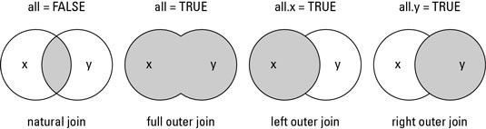

  
```{r, include = FALSE}
rm(list=ls())
#install.packages("DT")
#library(DT)
#datatable(mtcars, rownames = FALSE, filter="top", options = #list(pageLength = 5, scrollX=T) )
```

# [1] Administrative 

All material should be available on Sakai (after class), and if you have more questions feel free to reach out and ask for help. Trial and error really helps, work with your data and refer to your previous notes, applying the concepts from class on your data will really help you master the material faster.

## A brief review 

1. Assigning and saving values 

```{r, echo=FALSE}
x <- 8 
y <- 34 
```

2. Types 
```{r, echo=FALSE}
x <- c(1, "a", 2, "b") 
x # what is their types?
```

## Some new things we didn't go over

3. Debugging

- In R: 

```{r, echo=FALSE}
help("mean")
?str()
help("str")
str(x)
?c
```

On the internet: 
- https://stackoverflow.com - someone has probably asked your question before

```{r setup, include=FALSE}
knitr::opts_chunk$set(echo = TRUE)
```

## Lab 3: Working with Data 

Last week we opened data by using the point and click shortcut to load the data into R. 

- Reminder: From the RStudio dropdown menu, select `File > Import Dataset > From text (base)`, (see image below if these instructions are unclear) and then from the pop-up, locate your downloaded csv file. 

Today, I'll show you how we load and work with data in-line in the code. 

By the end of lab and you should have.....

1. **Familiarized yourself with common approaches to cleaning and pre-processing data**

* Reading in Data
* Subsetting our data
* Transforming and aggregating variables
* Merging across datasets

2. **Run through two examples of cleaning and pre-processing datasets**
* 2016 Cooperative Congressional Election Study Data [found here https://cces.gov.harvard.edu/] cces2016
* Fatal Encounters Dataset of Police Killings of Civilians [found here https://fatalencounters.org/] fatalencounters

3. **Created an analyzable dataset for a research question through cleaning and manipulating data in R**

# [2] Reading and Loading data 

Most of the time, the way we collect data is through some external source. That means our data is stored in some specific file format elsewhere, and we want to load it into R in order to work with the dataset in R. Before loading in the data we'll be using for this exercise, we can run through some of the common file types you'll see in and the commands you will use to load these files into R. 

* Comma Separated Value, or *.CSV* files. These represent tabular data similar to a spreadsheet of data values like those generated by Microsoft Excel. This is the most common type of data you will work with. To load these we use the ***<span style="color:red; font-family:Courier New; font-size:1em;">read_csv()</span>*** command 
* STATA Files, or *.DTA* files. This is data that was saved in the file format of the statistical programming software STATA. To load this data we use the ***<span style="color:red; font-family:Courier New; font-size:1em;">read.dta()</span>*** OR ***<span style="color:red; font-family:Courier New; font-size:1em;">read_dta()</span>*** commands, based on the version of STATA the data comes from. 
* RDatafiles or *.RDATA* files, which represent a collection of R objects including data sets. To load these we use the ***<span style="color:red; font-family:Courier New; font-size:1em;">load()</span>*** command. 

Sometimes there is no choice on the format that data is available, in other times, data is available for download in many forms, let us compare the CCES 2020 and CCES 2016 data as an example. 

[CCES 2020 Data on Harvard Dataverse](https://dataverse.harvard.edu/dataset.xhtml?persistentId=doi%3A10.7910/DVN/E9N6PH)

- As we can see, the CCES 2020 data exists in two forms, `.csv` and `.dta`. Typically, researchers will pick the form that suits their statistical programme best, but I will show you how to load both forms into R. 

[CCES 2016 Data on Harvard Dataverse](https://dataverse.harvard.edu/dataset.xhtml?persistentId=doi%3A10.7910/DVN/GDF6Z0)
- However, the CCES 2016 data only exist in `.tab`

If you aren't sure you can try googling the format. 

In summary, there are several 'read' functions that load data into R:

- read.csv() # for excel files (Note: first save excel file as .csv)
- read.table() # for text files (.txt) or table files (.tab)
- load() # for R data files
- read.spss() # for spss files (.sav)
- read.dta() # for stata files (Note: stata 13 files require special package)


**BUT**, To use the `read.spss()` and `read.dta()` functions, we will need a package to read the data

### [2.1] Packages 

R packages are extensions to R, they usually contain code and data that can be installed by users. Think of chrome extensions, they are applications written by developers to make your life easier, some of the things chrome extensions do are just shortcuts to bookmark pages or open external applications. 

One of the first ways you will interact with packages is using a package to load data as seen below. However, packages are also used to run regressions, plot graphs, as we will explore later.

#### Packages to load data

In R, you load R packages by first installing them > and then loading them. I will demonstrate this using the *foreign* package, foreign allows you to read data stored by programs like `SPSS` and `Stata`. 

- You can install packages using `install.packages("foreign")` where **foreign** is the name of your package. 
- Then you load your package by using `library(foreign)`. 
- Note that install requires `""` quotation marks, while library does not. 


```{r, echo = FALSE}
#install.packages("foreign")
library(foreign) #read.spss() , read_dta()
#library(haven) #read.dta()
library(readstata13) #read.dta13()
```

With that, let us load the two datasets we will be working with today. Go to the following websites and download the fatal encounters data in `.csv` format, and the CCES data (I would recommend using the Stata format and then loading the `.dta` file in), and load it into your R. 

- Remember to save and name your datasets, it would be best to call the CCES data **cces16** and the fatalencounters data **fatal**

```{r, include =FALSE}
load("CCES16_Common_OUTPUT_Feb2018_VV.RData")
cces16 <- x
fatal<-read.csv("fatal.csv")
```

# [3] Tidying and Manipulating Data

a) ***Importing*** different types of data from different sources
b) ***Cleaning*** the data, including subsetting, altering values, etc.
c) ***Merging*** the data with other data
d) All of this must be done while being mindful of the substantive research question you are interested in testing. 

Today the research question we are interested in is **are attitudes about law enforcement affected by police violence against civilians?**

> **Let's brainstorm** 
> What is the independent variable? 
> What is the dependent variable? 
> What could be the unit of analysis? 
> [Collect answers from class]
> [Break-out activity, half class do independent, half do dependent]
> How would you measure either of these? 
> Take 10 mins, find a partner, and go over the codebook of the variables together. 


```{r, include = FALSE, echo = FALSE, error = TRUE}
#The **independent variable** here is *presence of police violence within a zipcode* from the fatal encounters dataset.
#- aggregate incidences by zip code (city / county / address)
# - race 
# location of injury 
# type of death 
# cause of injury

#The **dependent variable** here is *support for increasing the number of police within a community* from the CCES dataset. 
# CC16_427_b - how you feel about 
# CC16_307 - scale of 1 to 4 
# 

#The **unit of analysis** here is *individuals within a zipcode*
```


### Ideal datasets

A useful strategy when trying to think about manipulating data is to identify what our absolutely ideal looking dataset would look like once we are finished working. I do this in nearly every project myself. What would it look like here. Remember, we are trying to determine whether attitudes about law enforcement are affected by police violence against civilians. 

A few things we want from an ideal dataset

1. The data should be stored in a single dataframe

2. The main identifier should be the unit of analysis

3. It should only have the variables we are interested in, so as to keep a tidy and clean dataset. CCES16 has 563 (!) variables an fatalencounters has 22. We can get rid of all these extraneous variables to have a tidier/cleaner dataframe for analysis. 

> What are the variables we are interested in keeping in the dataframes? 
> [[ Breakout activity 2]]


```{r, include = FALSE, echo = FALSE}
#In particular, we only need to keep the following columns (variables) in CCES: 

#* RespondentID (V101)
#* Respondent Race (race)
#* Respondent Zipcode (lookupzip)
#* Respondent Grade for Local Police (CC16_427_b)


#Now we need to do the same with the fatal encounters dataset, only keeping the following column (variable): 

#*Zipcode of killing (ZIP)
#* Date 
```


The next step in learning how to create one unified dataset is to first select the variables we are interested in, in each of the datasets (fatal, and cces2016). This brings us to the next part of the class, subsetting. 


## [3.1] Subsetting Our Data

One of the most common things you will do in R is subset data. *Subsetting* involves only keeping part of some larger dataframe based on a set of criteria that we offer the data in R. Put another way, subsetting is one way to manipulate a dataframe to only include those observations you need for analysis. 

When subsetting there are generally two approaches: 

1. First, we often subset using square brackets [c(rows), c(columns) ], based on the row and column numbers of the dataframe we want to keep. This approach is less common but may be useful to pull specific variables or observations out of your data. When you use this approach, the square brackets serve as indexers for your dataframe. data follow the Rows x Columns (RxC) principle; in other words, the first index is for Rows and the second index is for Columns [c(R), c(C)]. 
- Say we only want to keep the 8th column (variable) and rows 1:10 in our CCES dataframe. We would do the following:

```{r}
#rows 1:10, 8th column only#
cces16[c(1:10), c(1:8)]
```

Now we want to keep the 8th through column (variable) and rows 1:10 in our Fatal Encounters dataframe. We would do the following:

```{r}
#rows 1:10, 8th through 13th column only#
fatal[c(1:10), c(8:13)]
```

2. Next, the other way to subset is using the `subset()` command, which is the most common way of subsetting data. In particular, we use this command to only keep some subset of the data based on a set of criteria, rather than the location (row/column) of data. 
- newdf <- subset(olddf, condition-to-subset-on)

For example, we can use the subset command to make our data only represent survey respondents on the CCES in the state of North Carolina. We do so using the following syntax

```{r}
str(cces16$inputstate) # states are names (character), not numeric
NC <- subset(cces16, inputstate == "North Carolina")
## NC <- subset(cces16, inputstate == 37)
# subset if inputstate is 37 (North Carolina)
```

If we want to subset based on MULTIPLE conditions, we can do that easily, using  & (and) | (or) in our subset command. For example, say we want to only include CCES survey respondents from North Carolina and Georgia, we use the OR (|) to subset based on those criteria.

```{r}
ganc <-subset(cces16, inputstate == "North Carolina" | inputstate == "Georgia") # subset if inputstate is 37 (North Carolina) OR 13 (Georgia)

```

But what about if we want to subset to only look at say, individuals who work at a union (union) and self-report having voted in 2012 (CC16_316) ? We need to consult our codebook and be sure to use the & (and) during the subset command. 

```{r}
unionvote <-subset(cces16, CC16_316 == 4 & union == 1)
```

### Applying subset to cces16 and fatal 

Ok. Now we have some rough sense of how the subset command works in R. With that in mind, let's return to the research question at hand, which is attempting to assess whether ratings of the police become less favorable after police killings of civilians. 

Recall that we want the following variables from cces2016: 
* RespondentID (V101)
* Respondent Race (race)
* Respondent Zipcode (lookupzip)
* Respondent Grade for Local Police (CC16_427_b)

```{r}
#this code keeps all rows and ONLY the column names I call here
police_response <- cces16[, c("CC16_427_b", "lookupzip")] 
cces16merge <- cces16[, c("V101", "race", "lookupzip", "CC16_427_b", "inputstate")]
```


Now we need to do the same with the fatal encounters dataset, but what we need is two things - number of police killings per zipcode, and over a certain period of time. Note in the fatal.csv that the dataset starts from 2000 and ends in 2021. While the survey is only in 2016 **(what's the exact dates?? check pg 7 of the codebook)**. 

> How do we do this? 

*Zipcode of killing (ZIP) 
*Date

In addition, let's only limit this to killings that occurred in the year before respondents took their survey. Because survey responses began being collected as early as September 28th of 2016, we will subset our data to only include police killings between September 27th of 2015 and September 27th of 2016. 

```{r, echo=FALSE}
femerge <- subset(fatal, date > 09/27/15 & date < 09/27/16) 
```

Now...look...there are 0 observations for FEmerge!! What happened???


The problem lies with the structure of the date variable in fatalencounters. Using the ***<span style="color:red; font-family:Courier New; font-size:1em;">class()</span>*** command, we can see the type of data that the date variable is in the fatal encounters dataset. 

```{r}
summary(fatal$date)
class(fatal$date)

```

```{r}
summary(fatal$date)
```

So instead, we need to convert this to a date object. To do so, we'll need to use the ***<span style="color:red; font-family:Courier New; font-size:1em;">as.date()</span>*** command.The syntax of as.date is as follows: 

- df\$newvar<-as.date(df\$oldvar, format = "%y/%m/%d")

Where %y stands for year, %m stands for month, and %d stands for day and the / marks represent the dividing characters. Looking at the date variable in fatalencounters, it seems the format is actually month/day/year so we can specify that below. 

```{r}
fatal$dateformatted <- as.Date(fatal$date, format = "%m/%d/%y")

```

It is important to create a new variable rather than overwrite the old variable because it allows us to compare and see if the conversion to a date object worked. If we overwrote the old variable with our new variable we couldn't validate this. 

Let's compare the results: 

```{r}
head(fatal$dateformatted, 10)
head(fatal$date, 10)
```

See! The conversion worked! Now we can run that same code from earlier to subset our data. 

```{r}
femerge <- subset(fatal, dateformatted > "2015-09-27" & dateformatted < "2016-09-27")

```

## [3.2] Aggregating Data 

But things are a bit more complex here. Remember, we want to ultimately merge the fatalencounters dataset with the cces data, so that we can see if residing in a zipcode with police violence affects attitudes towards police. Right now this dataset has the unit of analysis of individual police killing of a civilian. If we ultimately merge this dataset with the cces data, we will end up *duplicating* many CCES responses, because in any zipcode with multiple police killings of civilians, we will end up merging EACH of them with EACH survey respondent. To put it in more concrete terms, if there are 8 police killings in the 27701 zipcode and 1 survey respondent in the 27701 zipcode, a simple merge will duplicate that 1 survey respondent 8 times in our dataframe. 

> So how should we aggregate the data?
> [class discussion]  - list steps below

> So how do we do this in R? 

- The answer is we need to aggregate our data using the `dplyr/tidyverse package`.

```{r, message = FALSE}
#install.packages("dplyr")
library(dplyr)
```


Some options from dplyr to manipulate data: 
** use `?help` to check what these functions do, eg: `?select` **

- select()
- filter()
- mutate()
- group_by()


Applying it on our dataset, this is what we want to do: 

The syntax of these aggregations are as follows: 
newdf<-oldf %>% 
  group_by(idvar) %>%
  summarise(obs = n(), 
  newvar = sum(oldvar))

```{r}
femergecollapsed <- femerge %>%
  group_by(ZIP) %>%
  summarise(numberofkillings = n())

head(femergecollapsed, 10)
```

## [3.2] Merging Data

Now we have two dataframes the way we want them. How do we join the information from the cces dataframe with the information from the fatalencounters dataframe? In R, we can use the `merge()` command. 

In R you use the merge() function to combine data frames. This  function tries to identify columns or rows that are common between the two different data frames using some common identifiers. 

There are 4 different kinds of merges, the type of merge determines what type of data is kept in the merger. 

1. Natural Join
2. Full Outer Join
3. Left Outer Join
4. Right Outer Join


[merge source](https://www.datasciencemadesimple.com/join-in-r-merge-in-r/)

```{r, echo = FALSE}
summary(cces16$lookupzip)
summary(fatal$ZIP)
#levels(as.factor(cces16$lookupzip))
#levels(as.factor(fatal$ZIP))
length(unique(cces16$lookupzip))
length(unique(fatal$ZIP))
```


In this case we need to do a left outer join, because there are more zipcodes in the survey data (cces16) than the police killings data (fatal). That means we want to keep all the data on our survey respondents ratings of the police, but only need to keep the data from fatal encounters that merges with our survey responses. That's because we don't need the data on every police killing of a civilian, we just want to compare how survey respondents living in zipcodes with a police killing rate their local police compared to respondents living in a zipcode without a recent police killing. 

The syntax of a merge is as follows. 

- newdf <- merge(datasetx, datasety, by.x = c("colnamex"), by.y = c("colnamey"), all = TRUE)

merge(cces, fatalencounters, by.x = c("lookupzip"), by.y = c("ZIP), all.x = TRUE )

The key to merging is to merge on some common identifying information across datasets. In this case that is zipcode! So in the by.x and by.y commands, we input the zipcode variable from both datasets. 

```{r}
mergeddf<-merge(cces16merge, femergecollapsed, by.x = c("lookupzip"), by.y = c("ZIP"), all.x = TRUE)
head(mergeddf, 10)
```

Success!!! Let's check out the data now using `table()`, which will tabulate rows and aggreate them for us.  While we're there, lets use `is.na()` or `summary()` to find out if we have missing data or not. 

```{r}
table(mergeddf$numberofkillings)
summary(mergeddf$numberofkillings)
sum(is.na(mergeddf$numberofkillings))
```

Whoa! We have 56,722 missing values? Why?

The reason is because our fatalencounters dataset presents every single police killing of a civilian that occurred (ostensibly). But it does NOT present data on the number of killings in each zipcode in the US. If we really believe fatalencounters then, we should treat all the missing/NA values as 0's, meaning no police killings of civilians in the last 12 months. 

To do so we will use the square brackets [ ] or indexing, and the is.na () command 

```{r}
mergeddf$numberofkillings[is.na(mergeddf$numberofkillings)] <- 0
mergeddf2 <- mergeddf %>%
  mutate(killings = ifelse(is.na(numberofkillings) == TRUE, 0, numberofkillings)) ## another way to recode numberofkillings NA's into 0, into the new variable killings

summary(mergeddf$numberofkillings)
sum(is.na(mergeddf$numberofkillings))

```

In addition, we also might want to compare respondents living in zipcodes with no police killings to respondents living in zipcodes with any number (1 or more). This requires us to use the same square brackets [ ] or indexing to create a new variable. The syntax to do this is

- df\$new[df$old == logical] <- newvalue

```{r}
mergeddf$binarykilling[mergeddf$numberofkillings  == 0] <- 0
mergeddf$binarykilling[mergeddf$numberofkillings  > 0] <- 1
```

Awesome! Finally, we have a final problem. Look at the dependent variable, grade for local police. Its class is not numeric, so we can't run any statistical analysis on it (and it becomes more difficult to plot). Lets convert this to numerical. It is a relatively simple fix. 

```{r}
head(mergeddf$CC16_427_b)
table(mergeddf$CC16_427_b)
class(mergeddf$CC16_427_b)
mergeddf$policegrade<-as.numeric(mergeddf$CC16_427_b)
table(mergeddf$policegrade)
```


Though we'll cover this more in Lab number four / five, considering we did all this work, lets use ggplot and take a look! 

```{r, include = FALSE}
library(ggplot2)
#now lets add a dotted line for the group means
p <- ggplot(mergeddf, aes(x=policegrade)) + 
    geom_histogram(aes(y = stat(width*density))) +
  scale_y_continuous(labels = scales::percent) +   scale_x_continuous(breaks=c(1,2,3, 4, 5),
        labels=c("A", "B", "C", "D", "F")) + 
  facet_grid(.~ binarykilling ) + 
    theme_bw() + 
    labs(title = "Police Killings and Grade Of Local Police",
       caption = "Data source: 2016 CCES (n = 64,600)",
       x = "Grade Towards Local Police",
       y = "Count") 

mnkill<-mean(mergeddf$policegrade[mergeddf$binarykilling == 1], na.rm = TRUE)
mnnokill<-mean(mergeddf$policegrade[mergeddf$binarykilling == 0], na.rm = TRUE)
df<-data.frame(binarykilling = c(1,0), grp.mean = c(2.6012, 2.482))

p+ geom_vline(data=df, aes(xintercept=grp.mean),
             linetype="dashed")


```

```{r, include = FALSE}
p <- ggplot(mergeddf, aes(x=policegrade)) + 
    geom_histogram(aes(y = stat(width*density))) +
  scale_y_continuous(labels = scales::percent) +   scale_x_continuous(breaks=c(1,2,3, 4, 5),
        labels=c("A", "B", "C", "D", "F")) + 
  facet_grid(.~ numberofkillings ) + 
    theme_bw() + 
    labs(title = "Police Killings and Grade Of Local Police",
       caption = "Data source: 2016 CCES (n = 64,600)",
       x = "Grade Towards Local Police",
       y = "Count") 
p

mnkill<-mean(mergeddf$policegrade[mergeddf$binarykilling == 1], na.rm = TRUE)
mnnokill<-mean(mergeddf$policegrade[mergeddf$binarykilling == 0], na.rm = TRUE)
df<-data.frame(binarykilling = c(1,0), grp.mean = c(2.6012, 2.482))

p+ geom_vline(data=df, aes(xintercept=grp.mean),
             linetype="dashed")
```


# [4] Summary

To summarize, we learned about the following functions / commands in R

1. `read.csv`
2. `read_dta`
3. `summary()`
4. `names()`
5. `head()`
6. `subset()`
7. `[r, c]`
8. `class()`
9. `merge()`
10. `group_by()`
11. `summarise()`
12. `table()`
13. `is.na()`
14. `as.numeric()`

This is obviously a lot to remember and a lot to make sense of in a single lecture. To that end, this video and rmd should serve the purpose of being a resource for you to use in the future when you are working on your final project. Other key resources for you to use, which I draw on heavily for this guide: 

* https://stackoverflow.com/ -- which contains answers to almost any coding question you may have
* https://github.com/rochelleterman/PS239T  -- A course on computational social science by Professor Rochelle Terman which contains tons of simple coding examples and explanations. The full r code from each session is posted online
*https://datavizf18.classes.andrewheiss.com/syllabus/ -- A course on data vizualization in R by Professor Andrew Heiss. Tons of code examples. 
* https://judgelord.github.io/PS811/ -- A course on statistical computing in social science by Dr. Devin Judge-Lord. 
* http://qss.princeton.press/ -- A textbook on statistical analysis in social and political science with guided examples by Dr. Kosuke Imai
* https://s3.amazonaws.com/assets.datacamp.com/blog_assets/Tidyverse+Cheat+Sheet.pdf -- A tidyverse cheat sheet with examples and easy to reference common functions

## Take-home Exercises

[**Lab 3 Exercises**](lab3-ex.html)
