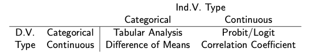

This week in methods class, we covered different types of hypothesis tests, depending on the level of measurement for the independent and dependent variables. 



The agenda in this lab is to demonstrate and execute a basic version of the tests discussed in class, we will be covering four tests, three of which directly come from the matrix above (I'll include probit/logit in a bonus section but will not cover it.)

1. Chi-squared test - Tabular Analysis
2. T-tests - Difference of means test
3. Correlation vs Covariance - Understanding the correlation coefficient
4. Bivariate Linear Regression / Ordinary Least Squares (OLS)  - Correlation regression

**A reminder about hypothesis testing :**

$H_0$: *the null hypothesis*
  - any difference observed is just the result of random chance
$H_1$: *the research hypothesis* 
  - the variables are dependent, there is a relationship between the two variables. Knowing the value of one variable helps to predict the value of the other variable
- we want to *reject the null hypothesis*

# Chi-squared $x^2$ test

A chi-square test typically is used to compare two categorical variables. It works by comparing the observed frequencies to the expected frequencies if there was no relationship between the two variables. 

You can do it by hand, and Dr. Siegel goes through this in Lecture 2 Part 1, on slide 54 onwards, when he goes through an example of how to conduct a $x^2$ test by hand. I will show you how to do this in R as well, using the function `chisq.test()`.

I'm going to run a hypothetical test to see if there is a difference in the number of 2008 voters, between the republican party and democratic party. The two variables of interest are `interest_voted2008` (did the respondent vote in the 2008 elections?), and `prevote_regpty` (what is the official party of registration of the respondent?)

## Setting up the data 

- We will be using data from the ANES 2012 survey throughout this lab.
- The codebook and data will be on sakai

```{r}
library(sjlabelled)
library(haven) # for opening .sav files
anes2012 <- read_sav("~/Dropbox/Duke/Summer 2021/RBSI Online/Methods Lab/anes_timeseries_2012/anes_timeseries_2012.sav")
```

- You always want to start by checking and preparing the data. 
  - You can check the codebook to find the levels of a data and how it has been coded. 
  - For **prevote_regpty** the possible responses to the question are: 
```{r, include = FALSE}
get_labels(anes2012$prevote_regpty)
```

  - So to keep the analysis as clean as possible, we might just want to restrict our chi-square analysis to those who answered `1. Democratic Party` or `2. Republican Party`, since we don't have any logical reason for recoding independents or those who didn't answer
  - Though note that there is a significant number of respondents who don't qualify under the restrictions (-1 Inapplicable: 2958; 4 None or Independent: 214; 5 Other: 456)
  
```{r}
table(anes2012$prevote_regpty)
anes2012$regpty <- ifelse(anes2012$prevote_regpty == 1, 1,
                  ifelse(anes2012$prevote_regpty == 2, 2, NA))
table(anes2012$regpty)
summary(anes2012$regpty) # Note the 3667 NAs
```

  - For **interest_voted2008*,the possible responses to the question are: 
```{r, include = FALSE}
get_labels(anes2012$interest_voted2008)
```

```{r}
summary(anes2012$interest_voted2008)
table(anes2012$interest_voted2008)
```

We only have 22 nonrespondents, so we can do a simple recode for this as well

```{r}
anes2012$interest_voted2008 <- ifelse(anes2012$interest_voted2008 > 0 , anes2012$interest_voted2008, NA )
table(anes2012$interest_voted2008)
```

## Chi-squared test + Analysis

Now for the chi-squared test: 

```{r}
chisq.test(anes2012$interest_voted2008, anes2012$regpty)
```

- Here the p-value is 0.0361, which means we can reject the null hypothesis at the 0.05 level, but not at the 0.01 level. 
  - the levels for hypothesis testing tend to be 0.10, 0.05, 0.01, and 0.001.
  - Interpreting this, it means that the number of 2008 voters differs significantly across party registration levels, at the 5 percent significance level. 
- For more on some interesting ways to present a contingency table and the difference between the observed and expected values, see [Antoine Soetewey's](https://statsandr.com/blog/chi-square-test-of-independence-in-r/) blog for some examples.

# T-test or differences in means test

The t-test or difference of means test is is used to determine if the null hypothesis can be rejected and that we can infer that the differences between the two samples are statistically significant. It is similar to the chi-squared test, but is better employed when the *dependent variable is continuous and the independent variable categorical*. 

Examples: 

1. Do republicans and democrats have different feelings toward the military?
  - independent variable: political affiliation (categorical)
  - dependent variable: feeling thermometer (continuous)
2. Does college-level literacy vary across states in the U.S.?
  - independent variable: Geographical region (categorical)
  - Dependent variable: percentage of college educated adults 

The difference in means test is referenced in Lecture 2, part 1, on slide 109 onwards. In R we perform the test using the function `t.test()`. Note that what the difference of means t-test, or a two-tailed t-test, concludes is whether there is a difference in means, rather than whether one mean is specifically less than or greater than the other - the latter type of test would be a one-tailed t-test, which R can also conduct, and is one of the options if you check `?t.test`. 

We will test the first example hypothesis **Do republicans and democrats have different feelings toward the military?**

**Hypothesis**: Is the relationship between party ideology `pid_x`  and support for the military `ftgr_military` statistically significant?

**Null Hypothesis:**: There is no difference in level of support for the military (proxied by feeling thermometer) between Republicans and Democrats


## Cleaning Data

As always, check the variables and clean up the data. 

From the codebook, pid_x should range from 1 to 7. And we know that feeling thermometers should range from 0 to 100. 
```{r, include = FALSE}
get_labels(anes2012$pid_x)
```

Hence we need to recode the values of either variable that doesn't fall within that range. I've chosen this time to recode them as new variables `ft_military_2` and `pid_x_2`. In pid_x_2, I've chosen to turn it into a binary variable, where 1 captures all respondents who identify as democrat-leaning (pid_x <= 3), and where 2 captures all respondents who identify as republican-leaning (pid_x >= 5). 

```{r}
summary(anes2012$ftgr_military) # Feeling thermometer should range from 0 to  100
summary(anes2012$pid_x) # pid_x should range from 1 to 7.
anes2012$ft_military_2 <- ifelse(anes2012$ftgr_military <0, NA, anes2012$ftgr_military)
anes2012$pid_x <- ifelse(anes2012$pid_x <0, NA, anes2012$pid_x)
anes2012$pid_x_2 <- ifelse(anes2012$pid_x <= 3, 1, 
                    ifelse(anes2012$pid_x >= 5, 2, NA))
table(anes2012$pid_x_2)
```

## T-test

```{r}
t.test(anes2012$pid_x_2, anes2012$ft_military_2)
```

**Interpreting the results**: 

Here, we see that the p-value is <2.2e-16, which means it is very close to 0. We can reject the null hypothesis at the 0.001 significance level, that there is no difference in respondents' feelings towards the military, between republican and democrat respondents. 

Does this follow through with our expectations of how people actually feel towards the military in real life? 

# Bivariate Regressions

The logic of regression is often thought of in terms of some independent variable $x$ can cause changes in some dependent variable $y$. So we can think of this relationship as resembling: 

$$Y = \alpha + \beta_1 X$$ 

Where $\beta$ is the coefficient that represents how much a unit change in independent variable $X$ results in a $\beta$ unit change in the dependent variable $Y$. 

In this section, we will be going over how to perform ordinary least squares (OLS) regessions in R, using the same example of political ideology and its effects on a voter's feelings towards the military. Here we are interested in how one unit change in political ideology (towards increased 'democratic-ness'), shifts one's feelings towards the military.

**The Hypothesis**: Voters who are recorded as more 'democratic' on the political ideology scale, are more likely to have negative feelings towards the military 

## Setting up the data 

- We will be using the same data from ANES 2012. 

- The **dependent variable** is `ftgr_military` which measures an individual's feelings towards obama - the ratings are between 0 to 100 degrees, where ratings between 50 and 100 indicate favorable feelings, and 0 to 50 indicates that the participant does not feel favorable towards the military 
- The **independent variable** is ``pid_x``, a 7 point measure of party ID, where 1 indicates a strong democrat, and 7 indicates a strong republican.

Earlier, we already cleaned up the variables, so we will be using the cleaned variables `ft_military_2`, and `pid_x`

```{r}
summary(anes2012$ft_military_2)
summary(anes2012$pid_x)
```


## Running the OLS 

To run an ordinary least squares regression, we can use the `lm()` function to create a linear regression model. If you use `?lm` you can see more details about how `lm()` works but here we use a simple setup: 

- lm(y ~ x, data)
- where y is the dependent variable, and x is the independent variable
- after defining the model (and saving it as an object), you use the `summary()` function to analyze the results of the model

```{r}
model1 <- lm(ft_military_2 ~ pid_x, data = anes2012)
summary(model1) 
```

### Interpretation 

The output for `summary()` shows the original `lm()` formula used, the summary statistics for the residuals, the coefficients for the predictor variables used, and performance measures for the model more generally. 

- The coefficient is the $\beta$ value for $X$ which we discussed in the beginning, it represents how much a unit change in independent variable $X$ results in a $\beta$ unit change in the dependent variable $Y$. 
- Hence, the summary output for the model predicts an increase of $1.2961$ in *ftmilitary_2* for every unit increase in *pid_x* - what does that mean in real terms? 
  - Remember that every unit increase in pid7 indicates a shift in ideology closer to Strong Republican
- **Statistical Significance**: We also discussed statistical significance in class, the model output gives us both the t value, but also automatically conducts a two-tailed test. Hence the $Pr(>|t|)$ value tells us at what level of significance the null hypothesis can be rejected at, $<2e-16$ or $***$ indicates that the threshold of significance is even smaller than 0.001. 
- **R-squared**: Lastly, the model output also provides some measures of goodness of fit, which will be important when comparing between different models, but does not have much interpretation value when just conducting hypothesis testing. 

# Multivariate Regressions 

Next, we move on to multivariate regressions, where we are comparing the effects of multiple independent variables on one dependent variable. Whereas before in the bivariate analysis we only had one $x$, this time we can have multiple $x$s. 

$$Y = \alpha + \beta_1 X_1 + \beta_2 X_2 + \beta_3 X_3 + \beta_4 X_4$$ 

This time we include two more independent variables, on top of `pid_x`: 
1. Pre family income - `inc_incgroup_pre` 
2. Religious practices - `relig_import`

```{r}
summary(anes2012$inc_incgroup_pre)
get_labels(anes2012$inc_incgroup_pre) #you will need the package sjlabelled to use the get_labels() function
```

```{r}
summary(anes2012$relig_import)
get_labels(anes2012$relig_import)
```

## Recoding both variables: 

```{r}
anes2012$faminc <- ifelse(anes2012$inc_incgroup_pre > 0 , anes2012$inc_incgroup_pre, NA)

anes2012$relig_import_2 <- ifelse(anes2012$relig_import > 0, anes2012$relig_import, NA)
```


```{r}
fit2 <- lm(ft_military_2 ~ pid_x + faminc + relig_import_2, data = anes2012)
summary(fit2)
```

Here we can make three inferences about the results: 

1. As political ideology increases one unit towards more 'republican' levels, the respondents' feeling towards the military increases by 1.26 units on average, and this effect is statistically significant at the 0.001 level. 
  - Also, the inclusion of more variables has not changed the effect of political ideology on feelings towards the military
2. As respondents' religious practices shift from important to not important, their feeling towards the military decreases by 7.08 units on average, and this is also significant at the 0.001 level. 
3. Family income has no statistically significant effect on one's feelings towards the military. 

# Glossary

The functions we've gone over today are: 

1. `chisq.test()`
2. `t.test()`
3. `lm()` + `summary()`